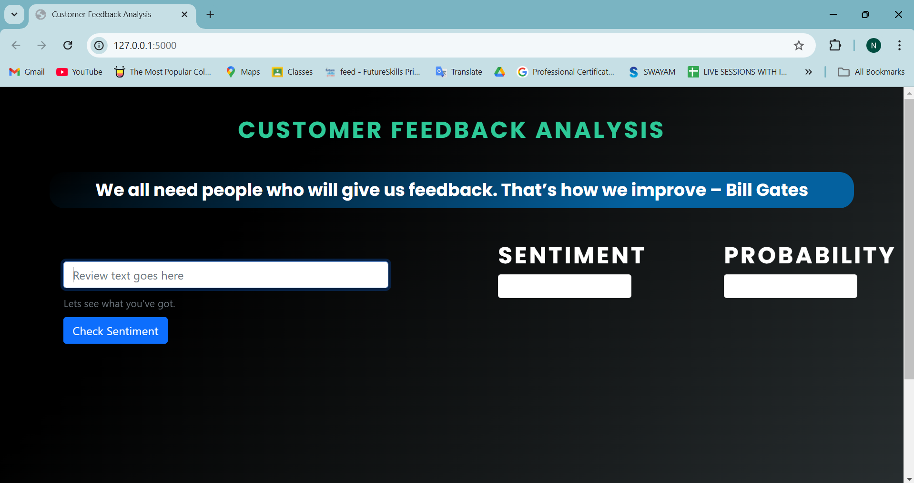
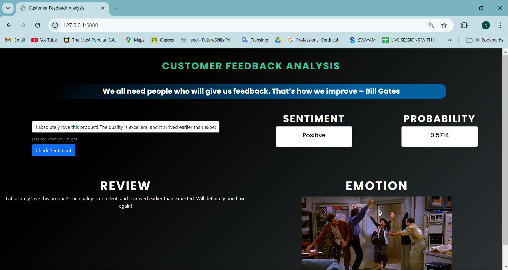
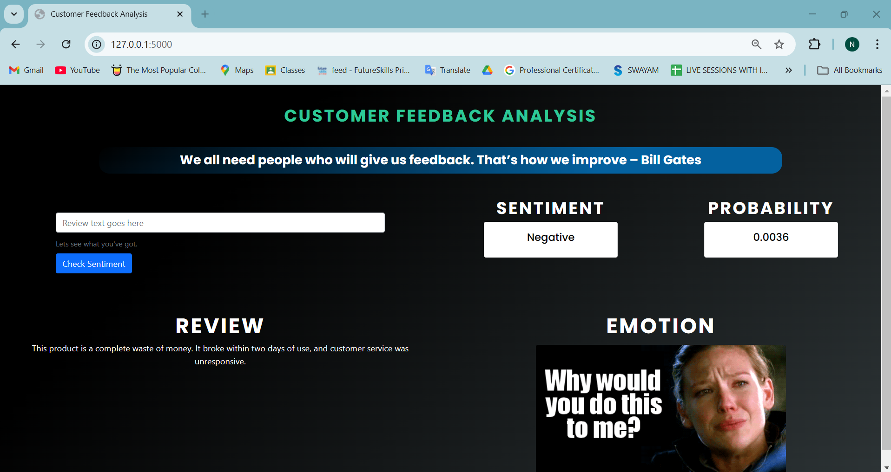

---

# Customer Feedback Sentiment Analysis

A Flask web application utilizing a Long Short-Term Memory (LSTM) Recurrent Neural Network (RNN) to classify customer reviews as **Positive** or **Negative**.

## Table of Contents

1. [Getting Started](#getting-started)
2. [Prerequisites](#prerequisites)
3. [Installation](#installation)
4. [Running the Application](#running-the-application)
5. [Dataset](#dataset)
6. [Built With](#built-with)
7. [Snapshots](#snapshots)

## Getting Started

Follow these instructions to get the application up and running on your local machine.

### 1. Clone the Repository

Clone the repository using the following command:

```bash
git clone https://github.com/Nehal04052/Customer-Feedback-Sentiment-Analysis-using-LSTM.git
```

Alternatively, you can [download the repository as a ZIP](https://github.com/your-username/Customer-Feedback-Sentiment-Analysis-using-LSTM/archive/refs/heads/main.zip) and extract it.

### 2. Set Up a Python Virtual Environment

1. Navigate to the project directory:
    ```bash
    cd Customer-Feedback-Sentiment-Analysis-using-LSTM
    ```

2. Create a virtual environment:
    ```bash
    python -m venv flaskapp
    ```
    > You can replace `flaskapp` with a name of your choice.

3. Activate the virtual environment:
    - On **Windows**:
        ```bash
        flaskapp\Scripts\activate.bat
        ```
    - On **Mac/Linux**:
        ```bash
        source flaskapp/bin/activate
        ```

### 3. Install Dependencies

Install the necessary packages listed in `requirements.txt`:

```bash
pip install -r requirements.txt
```

### 4. Configure Environment Variables

Set the environment variables for Flask:

- On **Windows**:
    ```bash
    set FLASK_APP=app.py
    set FLASK_ENV=development
    ```
- On **Mac/Linux**:
    ```bash
    export FLASK_APP=app.py
    export FLASK_ENV=development
    ```

### 5. Run the Flask Application

Start the application with:

```bash
python -m flask run
```

The app will be available locally at `http://127.0.0.1:5000/`. Open this URL in your web browser to interact with the app.

## Prerequisites

- [Python 3.x](https://www.python.org/downloads/) installed on your machine.

## Dataset

The project uses the [Twitter US Airline Sentiment Dataset](https://www.kaggle.com/crowdflower/twitter-airline-sentiment), which contains labeled tweets, to train and test the LSTM model for sentiment classification.

## Built With

- **[Python](https://www.python.org/)** - The core programming language.
- **[TensorFlow](https://www.tensorflow.org/)** - Deep learning framework for building the LSTM model.
- **[Flask](https://flask.palletsprojects.com/)** - Lightweight web framework for serving the model and handling requests.
- **[Pandas](https://pandas.pydata.org/)** - Data analysis and manipulation library.

## Snapshots

### Home Page


### Positive Sentiment Prediction


### Negative Sentiment Prediction


---